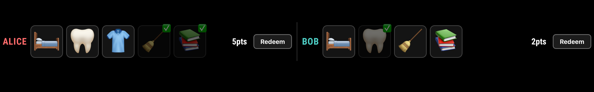
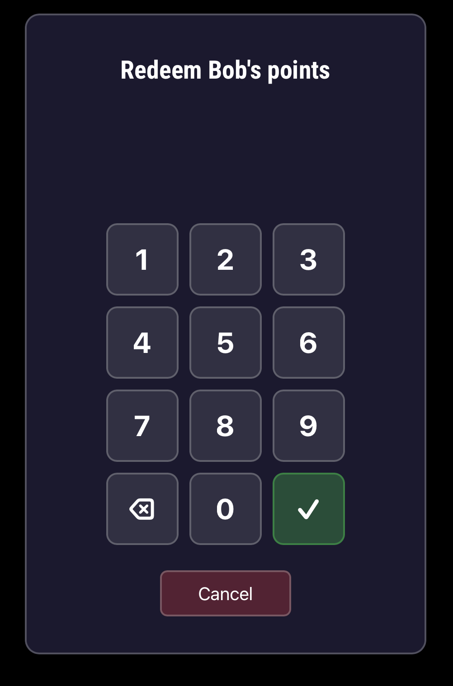

# MMM-Chores-Alt

*MMM-Chores-Alt* is a module for [MagicMirror²](https://github.com/MagicMirrorOrg/MagicMirror)
that lets children track their daily chores on a touchscreen. Each child gets a panel
with large tap buttons (supporting emoji or images for pre-reading-age children), a live
point tally, and a parent-PIN-protected redemption flow.

## Screenshots

Chore buttons with live point tally per child:



Parent-PIN redemption modal:



## Installation

### Install

```bash
cd ~/MagicMirror/modules
git clone [GitHub url] MMM-Chores-Alt
cd MMM-Chores-Alt
npm install
```

The `postinstall` hook runs `@electron/rebuild` against MagicMirror's pinned
Electron version so `better-sqlite3` works on the host. Use `npm install` (not
`npm ci --omit=optional`) to allow native rebuilds on each target platform.

### Update

```bash
cd ~/MagicMirror/modules/MMM-Chores-Alt
git pull
npm install
```

## Configuration

Add the module to the `modules` array in `config/config.js`:

```js
{
  'module': "MMM-Chores-Alt",
  position: "fullscreen_below",
  config: {
    parentPin: "1234",
    children: [
      {
        id: "child1",
        name: "Alice",
        color: "#ff6b6b",
        chores: [
          { id: "make-bed",    label: "Make Bed",    icon: "🛏️", points: 1 },
          { id: "brush-teeth", label: "Brush Teeth", icon: "🦷", points: 1 },
          { id: "get-dressed", label: "Get Dressed", icon: "👕", points: 1 },
          { id: "tidy-room",   label: "Tidy Room",   icon: "🧹", points: 2 },
          { id: "homework",    label: "Homework",    icon: "📚", points: 3 },
        ]
      },
      {
        id: "child2",
        name: "Bob",
        color: "#4ecdc4",
        chores: [
          { id: "make-bed",    label: "Make Bed",    icon: "🛏️", points: 1 },
          // Local image path (relative to MagicMirror root)
          { id: "brush-teeth",  label: "Brush Teeth",  icon: "/modules/MMM-Chores-Alt/icons/teeth.png", points: 1 }, 
          // External/absolute URL
          { id: "tidy-room",    label: "Tidy Room",    icon: "https://example.com/icons/room.png",       points: 1 },
          { id: "tidy-room",   label: "Tidy Room",   icon: "🧹", points: 2 },
          { id: "homework",    label: "Homework",    icon: "📚", points: 3 },
        ]
      }
    ]
  }
}
```

## Configuration options

| Option      | Type   | Default  | Description                              |
|-------------|--------|----------|------------------------------------------|
| `children`  | Array  | `[]`     | List of child objects (see schema below) |
| `parentPin` | String | `"0000"` | PIN required to redeem a child's tally   |

### Child object schema

| Field    | Type   | Required | Description           |
|----------|--------|----------|-----------------------|
| `id`     | String | Yes      | Unique identifier     |
| `name`   | String | Yes      | Display name          |
| `color`  | String | No       | Accent colour (hex)   |
| `chores` | Array  | Yes      | List of chore objects |

### Chore object schema

| Field    | Type   | Required | Description                                                                              |
|----------|--------|----------|------------------------------------------------------------------------------------------|
| `id`     | String | Yes      | Unique identifier within the child's list                                                |
| `icon`   | String | Yes      | Emoji string **or** image path/URL — paths containing `/` or `.` are rendered as `` |
| `label`  | String | No       | Text shown below the icon (omit if icon is self-explanatory)                             |
| `points` | Number | Yes      | Points awarded on completion                                                             |

## Development

Source lives in `src/` (TypeScript, strict). Build artefacts (`MMM-Chores-Alt.js`,
`node_helper.js`, and their `.js.map` siblings) are committed at the repo root so
MagicMirror loads them directly - do not hand-edit them.

- `npm install` - install dependencies (triggers `@electron/rebuild`)
- `npm run build` - build both frontend (UMD) and backend (CJS) artefacts
- `npm run dev` - watch-mode build
- `npm test` - run Vitest unit tests
- `npm run test:watch` - watch-mode tests
- `npm run lint` / `npm run lint:fix` - ESLint

No CI workflows, no Husky, no Prettier - ESLint is the sole style enforcer.

### Project layout

```text
src/
  frontend/    Frontend.ts (entry), render, stateDiff, stateReactor,
               pin, delight, icon
  backend/     index.ts (entry), Backend, repository, tally, stateBuilder,
               dateUtils
  constants/   SocketNotifications
  types/       Config, State, Domain, Effects
__tests__/unit/{frontend,backend}/   Vitest unit tests (happy-dom env)
```

See [`docs/features/typescript-conversion.spec.md`](docs/features/typescript-conversion.spec.md)
for the full conversion spec.

## License

This project is licensed under the MIT License — see the [LICENSE](LICENSE.md) file for details.

## Changelog

All notable changes to this project will be documented in the [CHANGELOG.md](CHANGELOG.md) file.
